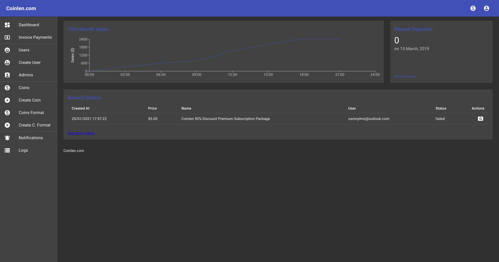

Coinlen is a cryptocurrency exchange tracking system. 
Coinlen compares Binance and Paribu/BtcTurk and shows you opportunities.

# Before you start

This repository is an open source and, it has been made using Javascript. There's no unit-test in this project.  
If someone wants to help improve this project, it would be nice.

- If you're new to set up a linux server, you can make research on the Google. 
- If you're looking for any servers I suggest you Digitalocean, AWS or GCloud.

# Contents

- [What should you know?](#what-should-you-know)
- [Introduction](#introduction)
    - [What is Coinlen?](#what-is-coinlen)
    - [Why is Coinlen an open source project?](#why-is-coinlen-an-open-source-project)
    - [Structure of the Coinlen Database](#structure-of-the-coinlen-database)
- [Before you install](#before-you-install)
    - [Requirements](#requirements) 
    - [Requirements for node](#requirements-for-node)
- [Prepare Installing](#prepare-installing)
- [Configurations](#configurations)
    - [Nginx configuration files](#nginx-configuration-files)
    - [PM2 configuration files](#pm2-configuration-files)
    - [Create a new database and a new user for MySQL / MariaDB and MongoDB](#create-a-new-database-and-a-new-user-for-mysql--mariadb-and-mongodb)
    - [Create new keys for Redis](#create-new-keys-for-redis)
    - [Configuration RethinkDB on Administrator Panel](#configuration-rethinkdb-on-administrator-panel)
- [Installing](#installing)
    - [Install server project](#install-server-project)
    - [Install socket-server project](#install-socket-server-project)
    - [Install provider project](#install-provider-project)
    - [Checking all services](#checking-all-services)
    - [Coinbase Payment Integrations](#coinbase-payment-integrations)
    - [Postman API Collection](#postman-api-collection)
    - [Build admin project](#build-admin-project)
    - [Build web-app project](#build-web-app-project)

## What should you know?

This project has been developed with the following technologies.

- [Javascript](https://developer.mozilla.org/en-US/docs/Web/JavaScript)
- [Nginx](https://nginx.org/)
- [MySQL](https://www.mysql.com/) / [MariaDB](https://mariadb.org/)
- [MongoDB](https://www.mongodb.com/)
- [RethinkDB](https://rethinkdb.com/)
- [Redis](https://redis.io/)
- [NodeJS](https://nodejs.org/en/)
- [ReactJS](https://reactjs.org)
- [SocketIO](https://socket.io/)

**If you don't know** any of these, you can check them out on Github or Google.
Be persistent to learn. If others can do it, you can do.

# Introduction

#### What is Coinlen?

Coinlen is a project tracking cryptocurrencies online. It took me 3-4 months to finish Coinlen part-time. 
To be honest, I planned to share this before, but I didn't have enough time to share it. 

#### Why is Coinlen an open source project?

After failing on the project, I decided to share it with you as open source. 

## TL;DR

It takes a long time to get Coinlen up and running. Get your coffee and enjoy :)

## Structure of the Coinlen Database

Coinlen is a micro-service project. 

What database technologies does Coinlen use.

| Service | Techology |
| --- | --- |
| Coins | RethinkDB |
| CoinsFormat | RethinkDB |
| CoinsHistory | RethinkDB |
| Notifications | RethinkDB |
| Logs | MongoDB |
| Payments | MySQL/MariaDB |
| Users | MySQL/MariaDB |

## Before you install 

### Requirements

- Ubuntu or any of Linux servers
- [Nginx](https://www.digitalocean.com/community/tutorials/how-to-install-nginx-on-ubuntu-20-04)
- [MySql/MariaDB](https://www.digitalocean.com/community/tutorials/how-to-install-mysql-on-ubuntu-20-04)
- [RethinkDB](https://rethinkdb.com/install)
- [Redis](https://www.digitalocean.com/community/tutorials/how-to-install-and-secure-redis-on-ubuntu-20-04)
- [MongoDB](https://www.digitalocean.com/community/tutorials/how-to-install-mongodb-on-ubuntu-20-04)

#### Requirements for Nodejs

- [nodejs](https://nodejs.org/en/)
- [pm2](https://pm2.io/)

## Prepare Installing

After your linux server is ready, follow these steps

```console
$ git clone https://github.com/manylmz/coinlen
```

### Configurations

#### Nginx configuration files

There is no SSL certificate configuration in these files. 

| Project | Configuration File |
| --- | --- |
| Api Server | server/nginx.conf |
| Socket Server | socket-server/nginx.conf |
| RethinkDB Admin | rethinkdb.admin.nginx.conf |
| Admin | admin/nginx.conf |
| Web App | web-app/nginx.conf |

After configured all Nginx projects, you may want to use SSL. I suggest [Let's Encrypt](https://letsencrypt.org/) 

Click below for more information.

[How To Secure Nginx with Let's Encrypt on Ubuntu](https://www.digitalocean.com/community/tutorials/how-to-secure-nginx-with-let-s-encrypt-on-ubuntu-20-04)  

#### PM2 configuration files

| Project | Configuration File |
| --- | --- |
| Api Server | server/ecosystem.config.js |
| Socket Server | socket-server/ecosystem.config.js |
| Provider | provider/ecosystem.config.js |

------------

#### Create a new database and a new user for MySQL / MariaDB and MongoDB

##### MySQL or MariaDB

```console
$ CREATE DATABASE database_name;
$ CREATE USER 'username'@'localhost' IDENTIFIED BY 'password';
$ GRANT PRIVILEGE ON database_name.table TO 'username'@'host';
$ FLUSH PRIVILEGES;
```

##### MongoDB

```console
$ use db_name;
$ db.createUser({user:'username', pwd:'password',roles:['dbOwner'']'});
```

#### Create new keys for Redis

Set all keys to Redis

```
$ set CURRENCY "1.0"
$ set COINS_1H "[]"
$ set COINS_12H "[]"
$ set COINS_24H "[]"
$ set COINS_7D "[]"
$ set AUTO_UPDATE "1"
```

#### Configuration RethinkDB on Administrator Panel

When you're done with the Administrator panel, go to `http(s)://realtime-admin-panel.your-project.com/rethinkdb-panel/#tables`

Press `+ Add Database` and create 4 tables

| PK | name |
| --- | --- |
| id | coins |
| id | coins_format |
| id | coins_history |
| id | notifications |

You suppose to protect the `RethinkDB Administration Panel` as the example below.


[How To Set Up Password Authentication with Nginx on Ubuntu](https://www.digitalocean.com/community/tutorials/how-to-set-up-password-authentication-with-nginx-on-ubuntu-14-04)

## Installing

### Install `api-server` project

After completing the nginx configuration of the server, you can start the server.

```
$ yarn install
```

The configuration of each service must be set in `.env`

```
$ cp .env.example .env
$ npx sequelize-cli db:migrate
$ npx sequelize-cli db:seed:all
$ pm2 start ecosystem.config.js
```

For `sequelize-cli` check [The Sequelize Command Line Interface (CLI)](https://github.com/sequelize/cli)

Don't forget to check if everything is ok.

```
$ pm2 logs
```

If you're done with the server, check it out `http(s)://api.your-project.com`

The response should be like this;

```json
{
  "statusCode": 404,
  "status": false,
  "message": "Not Found"
}
```

### Install `socket-server` project

After completing the nginx configuration of the socket-server, you can start the socket-server.

You can use yarn instead of npm.

```console
$ npm install
```

The configuration of each service must be set in `.env`

cp `.env.example` as `.env` 

```console
$ pm2 start ecosystem.config.js
```

Don't forget to check if everything is ok. 

```console
$ pm2 logs
```

If you're done with the server, check it out `http(s)://websocket.your-project.com/SOCKET_PATH`

The response should be like this;

```json
{
  "code": 0,
  "message": "Transport unknown"
}
```

### Install `provider` project

```console
$ yarn install
```

cp `.env.example` as `.env` 

```console
$ pm2 start ecosystem.config.js
```

### Checking all services

Please make sure all `server`, `socket-server` and `project` are working well. 

```console
$ pm2 ls
```

if you see this screen, it looks everything is fine.

| id | name | namespace | mode | pid | status | cpu | mem |
| ---- | ---- | ---- | ---- | ---- | ---- | ---- | ---- |
| 0 | provider-binance | default | fork | 0 | online | 0% | 10.0mb | 
| 1 | provider-paribu | default | fork | 0 | online | 0% | 10.0mb | 
| 2 | provider-btcturk | default | fork | 0 | online | 0% | 10.0mb | 
| 3 | scheduled-coins-grow | default | fork | 0 | online | 0% | 10.0mb | 
| 4 | scheduled-coins-history | default | fork | 0 | online | 0% | 10.0mb | 
| 5 | scheduled-currency | default | fork | 0 | online | 0% | 10.0mb | 
| 6 | scheduled-notifications | default | fork | 0 | online | 0% | 10.0mb | 
| 7 | server | default | fork | 0 | online | 0% | 10.0mb | 
| 8 | socket | default | fork | 0 | online | 0% | 10.0mb | 

You've done well until this step, congratulations. Just a few steps left to finish.     

### Coinbase Payment Integrations

If you use the payment system of web application' you have to integrate the Coinbase. 

More details; [Getting Started with Accepting Bitcoin | Coinbase Commerce](https://commerce.coinbase.com/docs/)

### Postman API Collection 

You may want to use the postman and here is the file to import `postman_collection.json`  

----------

### Build `admin` project

Run it

```console
$ yarn build
```

After you built `admin`, check `http(s)://admin.your-project.com`

_Login credentials for development_
```
Username: admin@admin.com
Password: admin
```

_Login credentials for production_
```
Username: admin@admin.com
Password: password
```



After you access to the admin, please change your login credentials.

### Build `web-app` project

Run it

```console
$ yarn build
```

After you built `web-app`, check `http(s)://app.your-project.com`

You can use Login credentials used for admin panel access.


# Buy me a Turkish Coffee or Tea 

You can support me with crypto money.

If you want to send me a `Bitcoin (BTC)` here is my BTC Address:

```
1PtAPNmETn6QvASbhfA6uxKSKZUXJ3HGcC
```
**Note:** Please send only BTC to this deposit address. Sending coin or token other than BTC to this address may result in the loss of your deposit.

----

If you want to send me an `Ethereum (ETH)` here is my ERC20 Address:

```
0xb7afc028a4b2a23da45941df38164445d5715c8a
```
**Note:** Please send only ETH to this deposit address. Sending coin or token other than ETH to this address may result in the loss of your deposit.

----

If you want to send me a `Litecoin (LTC)` here is my LTC Address:

```
LdMW7XBoQjBGoMvnG6ywhPNtbaUhHaRvFn
```
**Note:** Please send only LTC to this deposit address. Sending coin or token other than LTC to this address may result in the loss of your deposit.

# Logo's Rights

I really thank my friend because she made a logo to help.


# License

This repository is under GNU General Public License (GPL).
